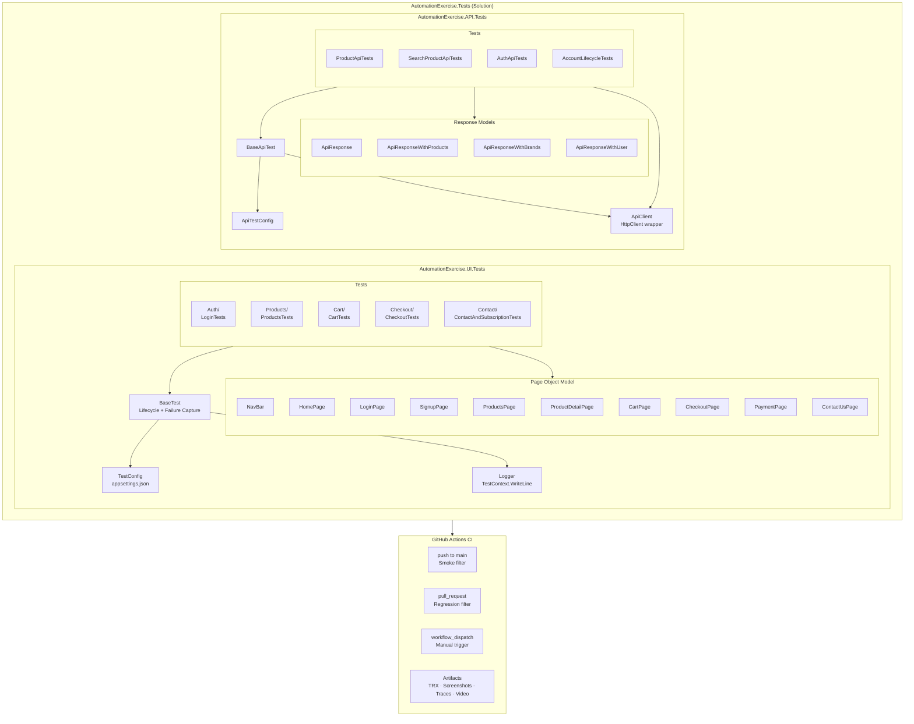

# AutomationExercise.Tests


A portfolio-grade test automation suite covering the [Automation Exercise](https://automationexercise.com) demo e-commerce site. Built with Playwright + C# + MSTest on .NET 10 LTS, it demonstrates real-world patterns across UI end-to-end testing and REST API testing — including the Page Object Model, typed API clients, parallel execution, failure artifact capture, and a GitHub Actions CI/CD pipeline.

---

## Tech Stack

| Tool | Version | Purpose |
|---|---|---|
| Visual Studio 2026 | 2026 | IDE — solution creation, NuGet management, Test Explorer, Git |
| .NET | 10.0 LTS | Runtime — supported until May 2028 |
| C# | 13 | Language |
| MSTest | 4.x | Test framework |
| Microsoft.Testing.Platform | built into MSTest 4.x | Test runner — replaces VSTest on .NET 10 |
| Microsoft.Playwright.MSTest | 1.50.0 | Browser automation and Playwright assertions |
| Bogus | latest stable | Realistic randomised test data generation |
| System.Text.Json | built into .NET 10 | JSON serialisation — no additional package needed |
| PowerShell 7 (`pwsh`) | 7.x | Required for Playwright browser install script |
| GitHub Actions | — | CI/CD pipeline |
| Playwright Trace Viewer | — | Failure debugging at trace.playwright.dev |
| MSTest TRX logger | — | Test reporting via `--report-trx` flag |

---

## Architecture



---

## Getting Started

### Prerequisites

- [.NET 10 SDK](https://dotnet.microsoft.com/download/dotnet/10.0)
- [PowerShell 7](https://aka.ms/powershell) (`pwsh`) — required for the Playwright browser install script. Install from the Microsoft Store if not present.
- A Chromium-compatible browser is installed automatically by the post-build MSBuild target on first build.

### Clone and restore

```powershell
git clone https://github.com/<your-username>/AutomationExercise.Tests.git
cd AutomationExercise.Tests

dotnet restore AutomationExercise.UI.Tests/AutomationExercise.UI.Tests.csproj
dotnet restore AutomationExercise.API.Tests/AutomationExercise.API.Tests.csproj
```

### Build (installs Playwright browsers automatically)

```powershell
dotnet build AutomationExercise.UI.Tests/AutomationExercise.UI.Tests.csproj
```

The post-build MSBuild target runs `playwright.ps1 install --with-deps` automatically. If `pwsh` is not found, install PowerShell 7 from the Microsoft Store.

### Run all UI tests

```powershell
dotnet run --project AutomationExercise.UI.Tests
```

### Run by category

```powershell
# Smoke suite — critical happy paths only
dotnet run --project AutomationExercise.UI.Tests -- --filter "TestCategory=Smoke"

# Full regression suite
dotnet run --project AutomationExercise.UI.Tests -- --filter "TestCategory=Regression"
```

### Run a single test by name

```powershell
dotnet run --project AutomationExercise.UI.Tests -- --filter "Homepage_Title_ContainsAutomationExercise"
```

### List all discovered tests without running

```powershell
dotnet run --project AutomationExercise.UI.Tests -- --list-tests
```

### Generate a TRX report

```powershell
dotnet run --project AutomationExercise.UI.Tests -- --report-trx --report-trx-filename ui-results.trx
```

### Run API tests

```powershell
dotnet run --project AutomationExercise.API.Tests
```

> **Note:** The `--` separator is required for all test runner arguments. Everything after `--` is passed to Microsoft.Testing.Platform, not to `dotnet run`.

---

## Project Structure

```
AutomationExercise.Tests/
├── .github/
│   └── workflows/
│       └── ci.yml                    ← GitHub Actions pipeline
├── AutomationExercise.UI.Tests/
│   ├── Pages/                        ← Page Object Model layer
│   │   ├── NavBar.cs                 ← Shared navigation component
│   │   ├── HomePage.cs
│   │   ├── LoginPage.cs
│   │   ├── SingupPage.cs
│   │   ├── ProductsPage.cs
│   │   ├── ProductDetailPage.cs
│   │   ├── CartPage.cs
│   │   ├── CheckoutPage.cs
│   │   ├── PaymentPage.cs
│   │   └── ContactUsPage.cs
│   ├── Tests/
│   │   ├── Auth/
│   │   │   └── LoginTests.cs
│   │   ├── Products/
│   │   │   └── ProductsTests.cs
│   │   ├── Cart/
│   │   │   └── CartTests.cs
│   │   ├── Checkout/
│   │   │   └── CheckoutTests.cs
│   │   ├── Contact/
│   │   │   └── ContactAndSubscriptionTests.cs
│   │   └── HomepageSmokeTests.cs
│   ├── Models/
│   │   └── AccountDetails.cs         ← AccountDetails and CardDetails records
│   ├── Utils/
│   │   ├── TestConfig.cs             ← Typed appsettings.json wrapper
│   │   ├── Logger.cs                 ← Timestamped TestContext logger
│   │   └── AssertionHelper.cs        ← Domain-specific assertion wrappers
│   ├── AssemblyConfig.cs             ← Parallel execution config (4 workers)
│   ├── BaseTest.cs                   ← Browser lifecycle + failure capture
│   ├── GlobalUsings.cs
│   ├── appsettings.json
│   └── appsettings.ci.json
├── AutomationExercise.API.Tests/
│   ├── Clients/
│   │   └── ApiClient.cs              ← Typed HttpClient wrapper
│   ├── Models/
│   │   ├── ApiResponse.cs            ← Response envelope models
│   │   ├── Product.cs
│   │   └── UserDetail.cs
│   ├── Tests/
│   │   ├── ProductApiTests.cs        ← GET /api/productsList, GET /api/brandsList
│   │   ├── SearchProductApiTests.cs  ← POST /api/searchProduct
│   │   ├── AuthApiTests.cs           ← POST/DELETE /api/verifyLogin
│   │   └── AccountLifecycleTests.cs  ← create → update → read → delete
│   ├── Utils/
│   │   └── ApiTestConfig.cs
│   ├── AssemblyConfig.cs
│   ├── BaseApiTest.cs
│   ├── GlobalUsings.cs
│   ├── appsettings.json
│   └── appsettings.ci.json
├── AssemblyConfig.cs
├── AutomationExercise.Tests.slnx
└── README.md
```

---

## Configuration Reference

Both projects read from `appsettings.json`, with `appsettings.ci.json` applied as an optional override when the environment variable `DOTNET_ENVIRONMENT=ci` is set.

### UI.Tests — `appsettings.json`

| Field | Type | Default | Description |
|---|---|---|---|
| `TestSettings:BaseUrl` | string | `https://automationexercise.com` | Base URL injected into Playwright's `BrowserNewContextOptions.BaseURL` |
| `TestSettings:Timeout` | int (ms) | `30000` | Default Playwright timeout applied via `Page.SetDefaultTimeout()` |
| `TestSettings:Headless` | bool | `false` | `true` runs Chromium without a visible window. Set to `true` in `appsettings.ci.json` |

### API.Tests — `appsettings.json`

| Field | Type | Default | Description |
|---|---|---|---|
| `TestSettings:BaseUrl` | string | `https://automationexercise.com` | Base URL set on `HttpClient.BaseAddress` |
| `TestSettings:Timeout` | int (ms) | `30000` | `HttpClient.Timeout` in milliseconds |

### CI override

```powershell
# Activates appsettings.ci.json — headless mode, 60 s timeout
$env:DOTNET_ENVIRONMENT = "ci"
dotnet run --project AutomationExercise.UI.Tests
```

In GitHub Actions the `DOTNET_ENVIRONMENT: ci` environment variable is set at the job level, so no manual step is needed.

---

## Test Coverage

### UI Tests

| Area | Test | Category |
|---|---|---|
| Homepage | Title contains "Automation Exercise" | Smoke |
| Auth | Login with invalid credentials shows error | Regression |
| Auth | Login page shows both login and signup forms | Regression |
| Products | ALL PRODUCTS heading is visible | Smoke |
| Products | Product grid is not empty | Smoke |
| Products | First product detail has name and price | Regression |
| Products | First product detail has category and brand | Regression |
| Products | Search for "dress" returns results | Regression |
| Products | Search result names contain search term | Regression |
| Products | Category filter Women > Dress shows products | Regression |
| Products | Category filter Men > Tshirts shows products | Regression |
| Products | Brand sidebar is not empty | Regression |
| Products | Brand filter Polo shows products | Regression |
| Cart | Add product from products page appears in cart | Smoke, Critical |
| Cart | Add product from detail page appears in cart | Regression |
| Cart | Remove product leaves cart empty | Regression |
| Cart | Quantity set on detail page is correct in cart | Regression |
| Cart | Unit price is present in cart | Regression |
| Cart | Adding two products shows two cart rows | Regression |
| Checkout | Guest checkout proceed redirects to login | Regression |
| Contact | Contact form submit shows success message | Regression |
| Contact | Home button after submission navigates home | Regression |
| Contact | Newsletter subscribe from homepage succeeds | Regression |
| Contact | Newsletter subscribe from cart page succeeds | Regression |

Account-dependent flows (register, login with valid credentials, logout, checkout as registered user, verify address, download invoice) are **intentionally omitted from the UI suite**. Running repeated account creation/deletion cycles against a live shared demo site is inconsiderate to the site owner and other users. These flows are fully covered at the API layer instead, where a single HTTP call is far less impactful than a full browser session.

### API Tests

| Endpoint | Method | Test |
|---|---|---|
| `/api/productsList` | GET | Returns responseCode 200 |
| `/api/productsList` | GET | Product list is not empty |
| `/api/productsList` | GET | First product has all required schema fields |
| `/api/brandsList` | GET | Returns responseCode 200 |
| `/api/brandsList` | GET | Brands list is not empty |
| `/api/brandsList` | GET | Every brand has an id and name |
| `/api/searchProduct` | POST | Valid search returns responseCode 200 |
| `/api/searchProduct` | POST | Valid search returns matching results |
| `/api/searchProduct` | POST | Result names contain search term |
| `/api/searchProduct` | POST (no param) | Missing parameter returns responseCode 400 in body |
| `/api/searchProduct` | POST (no param) | Error response message is not empty |
| `/api/verifyLogin` | POST | Valid credentials return responseCode 200 |
| `/api/verifyLogin` | POST | Invalid credentials return responseCode 404 |
| `/api/verifyLogin` | POST | Invalid credentials response message is not empty |
| `/api/verifyLogin` | DELETE | Method not allowed returns responseCode 405 |
| `/api/createAccount` | POST | Account exists after creation (verified via getUserDetailByEmail) |
| `/api/updateAccount` | PUT | Update returns responseCode 200 |
| `/api/updateAccount` | PUT | Updated field is reflected on subsequent read |
| `/api/getUserDetailByEmail` | GET | Returns correct user data for known email |
| `/api/getUserDetailByEmail` | GET | Returns responseCode 404 for unknown email |
| `/api/deleteAccount` | DELETE | Returns responseCode 200 after deletion |

---

## Reporting — Playwright Trace Viewer

When a UI test fails, `BaseTest` captures three artifacts automatically:

- **Screenshot** — full-page PNG saved to `/tmp/pw-screenshots/`
- **Trace** — Playwright trace ZIP saved to `/tmp/pw-traces/`
- **Video** — `.webm` recording saved to `/tmp/pw-video/` (passing tests have their video deleted to save disk space)

All three are attached to the MSTest result via `TestContext.AddResultFile()` and uploaded as GitHub Actions artifacts on failure.

To open a trace locally:

1. Download the `.zip` trace file from the GitHub Actions run artifacts.
2. Open [trace.playwright.dev](https://trace.playwright.dev) in your browser.
3. Drag and drop the `.zip` file onto the page.

No install is required — the trace viewer runs entirely in the browser.

---

## Design Decisions

**Page Object Model.** Interaction logic and selectors are encapsulated inside page objects. Tests contain only assertions. When a selector changes on the target site, only the page object needs updating — not every test that touches that element. Locators are defined as private `ILocator` fields at the top of each class; raw selector strings never appear inside methods.

**Manual `BaseTest` instead of `PageTest`.** `PageTest` from `Microsoft.Playwright.MSTest` is incompatible with Microsoft.Testing.Platform on .NET 10. `BaseTest` reimplements the same lifecycle (`IPlaywright` → `IBrowser` → `IBrowserContext` → `IPage`) with the addition of failure artifact capture (screenshot, trace, video) and typed config loading. The result is functionally equivalent to `PageTest` with more control and no compatibility constraint.

**MSTest with Microsoft.Testing.Platform.** VSTest is gone on .NET 10. Microsoft.Testing.Platform is the modern replacement, built into the `MSTest` meta-package. Tests run via `dotnet run --project` rather than `dotnet test`. This is a deliberate, non-optional choice for .NET 10 projects.

**`OutputType=Exe`.** Microsoft.Testing.Platform generates a program entry point, which requires the project to be an executable. Without this, the build fails.

**Two projects in one solution.** UI tests need Playwright and a browser context per test class. API tests need only `HttpClient`. Keeping them in separate projects means independent NuGet dependency trees, independent CI jobs, and targeted `dotnet run --project` invocations. A single merged project would make running only the API tests awkward.

**`HttpClient` over RestSharp.** `System.Net.Http.HttpClient` is built into .NET 10 — no additional NuGet dependency, no version to maintain, and sufficient for all the HTTP verbs the Automation Exercise API uses (`GET`, `POST`, `PUT`, `DELETE` with form-encoded bodies).

**Bogus for test data.** Tests that need user data (name, email, address, card) use `Bogus` to generate realistic random values. No hardcoded credentials appear in source control, and each test run produces unique data that avoids collisions when tests run in parallel or are re-run repeatedly.

**`ClassInitialize` / `ClassCleanup` for API account fixtures.** `AuthApiTests` and `AccountLifecycleTests` each own a throwaway account. Creating it in `ClassInitialize` and deleting it in `ClassCleanup` means: (a) the live site is never left with dangling accounts even if an individual test method fails, and (b) tests within the class are independently named and reportable. Both classes are marked `[DoNotParallelize]` because they manage shared static state.

**.NET 10 LTS.** Supported until May 2028. .NET 8 reaches end-of-life November 2026 — a project built today on .NET 8 would need upgrading within two years.

---

## Known Site Quirks

**API always returns HTTP 200.** The Automation Exercise API uses HTTP 200 for every response, including errors. The actual status is in the `responseCode` field of the JSON body. Tests must inspect the body — asserting only on `response.StatusCode` would give false passes for every error scenario. This is documented in `ApiClient.cs` and reflected in every API test assertion.

**Newsletter subscription widget ID has a typo.** The email input for the homepage subscription widget has the ID `susbscibeemail` (note the extra `s` and transposed letters). This is the real ID on the live site, not a typo in the code. The comment `// ⚠️ Three s's in 'susbscibeemail' — this is the actual ID on the site` appears in `HomePage.cs` to prevent future confusion.

**Contact form triggers a browser `confirm()` dialog.** Submitting the contact form fires a native browser confirmation dialog synchronously. Playwright's dialog handler must be registered _before_ the click — registering it after means the dialog has already fired and blocked. `ContactUsPage.SubmitAsync()` registers the handler before calling `ClickAsync()`.

**Slow first-page load.** The target site can be slow on first load. The default timeout of 30 seconds in `appsettings.json` is sized to accommodate this. The CI override (`appsettings.ci.json`) raises it to 60 seconds, which covers additional latency on GitHub-hosted runners.

**Newsletter subscription confirmation can be slow.** The success widget for newsletter subscription depends on an external trigger and can take a moment to appear. The two subscription tests carry `[Retry(1)]` to absorb occasional flakiness. Each retry attribute has an inline comment explaining why it exists — untargeted retries across the whole suite would mask real failures.

---

## CI/CD

The GitHub Actions pipeline (`.github/workflows/ci.yml`) runs two parallel jobs: `ui-tests` and `api-tests`.

**Triggers:**

- **Push to `master`** — runs the Smoke UI test filter + full API suite
- **Pull request** — runs the full Regression UI filter + full API suite
- **Manual dispatch** (`workflow_dispatch`) — choose suite (Smoke / Regression / All) and project (Both / UI / API) from the Actions UI

**UI test job steps:**
1. Checkout repository
2. Setup .NET 10
3. Restore NuGet packages
4. Build (Release configuration)
5. Install Playwright browsers via `pwsh playwright.ps1 install --with-deps`
6. Determine test filter from trigger type
7. Run tests via `dotnet run --project` with `--report-trx`
8. Upload TRX results (30-day retention)
9. Upload failure artifacts — screenshots, traces, video (7-day retention, failure runs only)

**API test job steps:**
1–4 same as UI job (no browser install step needed)
5. Run full API suite via `dotnet run --project` with `--report-trx`
6. Upload TRX results (30-day retention)

`DOTNET_ENVIRONMENT: ci` is set at the job level, activating `appsettings.ci.json` for both projects automatically.

> After the first successful pipeline run, replace `<your-username>` in the badge URL at the top of this file with your actual GitHub username.

---

## Reference Links

- [Automation Exercise — Test Cases](https://automationexercise.com/test_cases)
- [Automation Exercise — API List](https://automationexercise.com/api_list)
- [Microsoft Playwright for .NET docs](https://playwright.dev/dotnet/)
- [MSTest docs](https://learn.microsoft.com/en-us/dotnet/core/testing/unit-testing-mstest-intro)
- [Microsoft.Testing.Platform docs](https://learn.microsoft.com/en-us/dotnet/core/testing/microsoft-testing-platform-intro)
- [Bogus NuGet](https://github.com/bchavez/Bogus)
- [Playwright Trace Viewer](https://trace.playwright.dev)
- [.NET 10 release notes](https://learn.microsoft.com/en-us/dotnet/core/whats-new/dotnet-10/overview)
